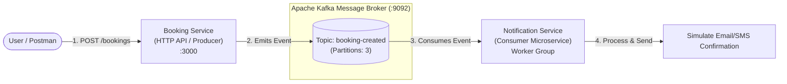

# Ticket Booking Microservices with NestJS & Apache Kafka

A step-by-step hands-on learning project to master Event-Driven Microservices using NestJS and Apache Kafka.

---

## 1. System Architecture



---

## 2. Microservices Breakdown

| Service | Role | Transport | Port / Group |
| :--- | :--- | :--- | :--- |
| **Kafka & Kafka-UI** | Message Broker & Visual Dashboard | KRaft / TCP & HTTP | `localhost:9092` & `localhost:8080` |
| **`booking-service`** | HTTP REST Gateway + Kafka Producer | Express HTTP + Kafka | Port `3000` |
| **`notification-service`** | Kafka Consumer Worker | Kafka Microservice | Consumer Group `notification-consumer-group` |

---

## 3. How to Run the Project

### Step 1: Start Infrastructure (Kafka & Kafka-UI)
```bash
docker compose up -d
```
> View the live dashboard at: **http://localhost:8080**

### Step 2: Start Booking Service (Terminal 1)
```bash
npm run start:booking
# Or: cd booking-service && npm run start:dev
```

### Step 3: Start Notification Service (Terminal 2)
```bash
npm run start:notification
# Or: cd notification-service && npm run start:dev
```

### Step 4: Test a Booking Request (Terminal 3 or Postman)
```bash
curl -X POST http://localhost:3000/bookings \
  -H "Content-Type: application/json" \
  -d '{"userId":"usr-101","eventName":"Coldplay Concert","ticketCount":2,"price":75}'
```

---

## 4. Learning Checklist

- [x] **Step 1: Kafka Infrastructure** (Docker Compose with KRaft mode & Kafka UI)
- [x] **Step 2: Service 1 - Booking Service** (NestJS HTTP API + Kafka Producer)
- [x] **Step 3: Service 2 - Notification Service** (NestJS Kafka Consumer Microservice)
- [ ] **Step 4: Live Verification & Testing** (Trigger booking, monitor live messages in Kafka-UI, observe consumer logs)
- [ ] **Step 5: Advanced Patterns** (Request-Reply pattern vs Event Streaming, Consumer Groups scaling)
