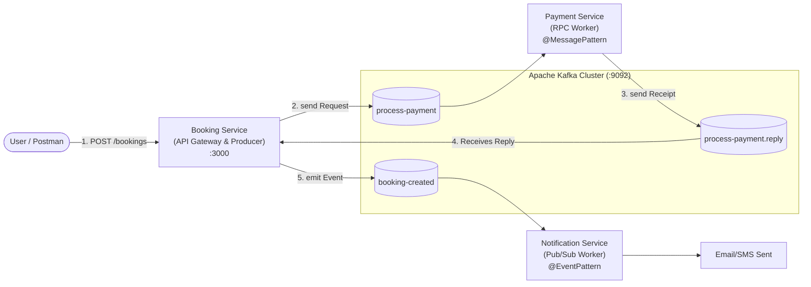

# Ticket Booking Microservices with NestJS & Apache Kafka

A complete, production-grade learning project demonstrating **Event-Driven Architecture** and **Microservices Orchestration** using NestJS and Apache Kafka.

---

## 1. System Architecture



---

## 2. Microservices Breakdown

| Service | Role | Pattern | Communication |
| :--- | :--- | :--- | :--- |
| **Kafka & Kafka-UI** | Message Broker & Visual Dashboard | Infrastructure | `localhost:9092` & `localhost:8080` |
| **`booking-service`** | API Gateway & Orchestrator | HTTP REST + Kafka Client | Port `3000` |
| **`payment-service`** | Payment Processing Worker | **Request-Reply RPC** (`@MessagePattern`) | Kafka (`process-payment`) |
| **`notification-service`** | Email/SMS Notification Worker | **Event Streaming** (`@EventPattern`) | Kafka (`booking-created`) |

---

## 3. How to Run the Complete System

### Step 1: Start Infrastructure
```bash
docker compose up -d
```
> Open Kafka UI at: **http://localhost:8080**

### Step 2: Start Payment Service (Terminal 1)
```bash
npm run start:payment
# Or: cd payment-service && npm run start
```

### Step 3: Start Notification Service (Terminal 2)
```bash
npm run start:notification
# Or: cd notification-service && npm run start
```

### Step 4: Start Booking Service (Terminal 3)
```bash
npm run start:booking
# Or: cd booking-service && npm run start
```

### Step 5: Test Booking with Postman / Curl
```bash
curl -X POST http://localhost:3000/bookings \
  -H "Content-Type: application/json" \
  -d '{"userId":"usr-777","eventName":"World Cup Final","ticketCount":2,"price":300}'
```

---

## 4. Key Concepts Mastered

1. **Pub/Sub vs RPC**:
   - `client.emit()` + `@EventPattern`: Asynchronous fire-and-forget event streaming.
   - `client.send()` + `@MessagePattern`: Synchronous-style Request-Reply RPC over Kafka with correlation IDs.
2. **Kafka Networking in Docker**:
   - Dual listeners: `PLAINTEXT://localhost:9092` (host) and `PLAINTEXT_INTERNAL://kafka:29092` (containers).
3. **Consumer Groups & Offsets**:
   - Partition balancing, consumer lag monitoring, and zero-data-loss resiliency.
